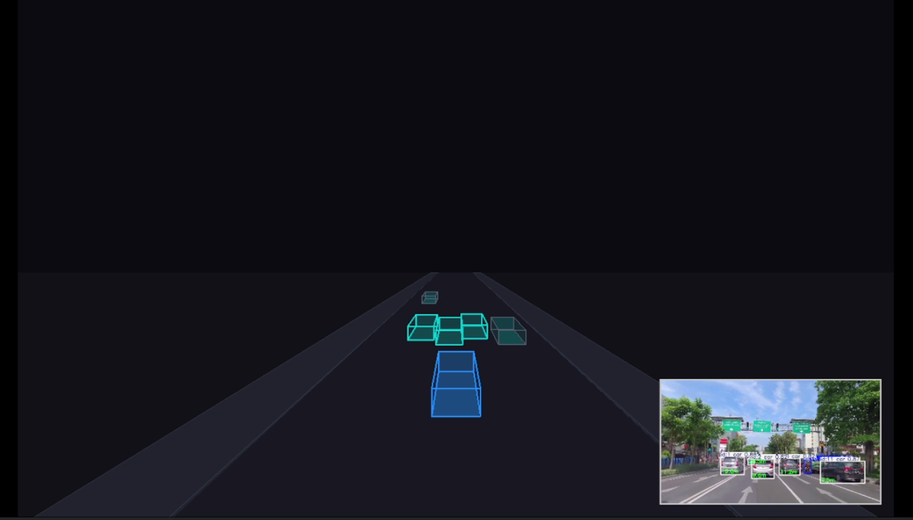

# VisionDrive 3D

[](https://colab.research.google.com/github/YOUR_USERNAME/visiondrive3d/blob/main/colab_export.ipynb)

Sistem visualisasi mengemudi otonom berbasis YOLO dengan tampilan pseudo-3D gaya Tesla FSD.
Program membaca video dashcam, mendeteksi kendaraan di sekitar, lalu memproyeksikannya ke tampilan bird's-eye view 3D secara real-time.

---

## Cara Kerja

1. Video dashcam dibaca frame per frame menggunakan OpenCV.
2. Setiap frame diproses oleh model YOLO untuk mendeteksi kendaraan (mobil, motor).
3. Jarak kendaraan diestimasi menggunakan dua metode perspektif:
   - tinggi bounding box dibanding tinggi nyata objek
   - posisi vertikal bounding box relatif terhadap garis horizon
4. Posisi 3D setiap kendaraan dihaluskan antar-frame menggunakan Exponential Moving Average (EMA).
5. Kendaraan yang saling tumpang tindih lebih dari 50% area difilter menggunakan occlusion filter.
6. Hasil deteksi dirender ke tampilan pseudo-3D menggunakan Pygame.
7. Video asli dengan anotasi ditampilkan sebagai Picture-in-Picture di sudut layar.

---

## Struktur Proyek

```
visiondrive3d/
|
|-- inf.py                  entri utama, jalankan file ini
|-- colab_export.ipynb      notebook untuk export video di Google Colab
|
|-- src/
|   |-- __init__.py         re-export semua modul
|   |-- config.py           konstanta: warna, ukuran layar, geometri jalan, kamera
|   |-- projection.py       fungsi proyeksi koordinat 3d ke pixel layar
|   |-- vehicles.py         class EgoVehicle dan Vehicle
|   |-- drawing.py          fungsi render: draw_box, draw_road, draw_hud
|
|-- yolo11n.pt              model YOLO yang digunakan untuk deteksi
```

---

## Dependensi

```
ultralytics
opencv-python
pygame
numpy
```

Install sekaligus:

```
pip install ultralytics opencv-python pygame numpy
```

---

## Menjalankan

Siapkan file video dengan nama `vx1.mp4` di folder yang sama, lalu:

```
python inf.py
```

Untuk mengganti file video, ubah baris terakhir di `inf.py`:

```python
app = InferVisualizer("nama_video.mp4")
```

---

## Kontrol

| Tombol | Fungsi             |
|--------|--------------------|
| SPACE  | pause / resume     |
| ESC    | keluar             |

---

## Parameter Tuning

Semua parameter utama bisa diubah di `src/config.py` (ukuran layar, warna, geometri jalan) dan di bagian atas `inf.py` (kelas target, dimensi kendaraan, alpha EMA).

| Parameter         | Lokasi          | Keterangan                                      |
|-------------------|-----------------|-------------------------------------------------|
| `TARGET_CLASSES`  | `inf.py`        | kelas kendaraan yang dideteksi                  |
| `CLASS_DIMS`      | `inf.py`        | dimensi nyata tiap tipe kendaraan (meter)       |
| `alpha`           | `Tracker`       | faktor EMA smoothing (lebih kecil = lebih halus)|
| `ROAD_W`          | `src/config.py` | lebar total jalan dalam meter                   |
| `FOCAL`           | `src/config.py` | focal length proyeksi pseudo-3d                 |
| `CAM_Y_OFFSET`    | `src/config.py` | jarak kamera mundur dari ego vehicle            |

---

## Google Colab Export

Untuk menjalankan tanpa instalasi lokal dan mengekspor hasilnya sebagai file video:

1. Klik badge **Open in Colab** di bagian atas README.
2. Jalankan cell pertama untuk clone repo (ubah `REPO_URL` ke URL repo kamu).
3. Upload file video dashcam ketika diminta.
4. Atur parameter di cell konfigurasi jika perlu.
5. Jalankan cell export — progres ditampilkan tiap 30 frame.
6. Download `output.mp4` via cell terakhir, atau preview langsung di notebook.

Tidak perlu pygame window atau display. Render dilakukan secara headless menggunakan `SDL_VIDEODRIVER=dummy`.

---

## Preview


## Catatan

- Model default `yolo11n.pt` adalah versi nano, cepat tapi akurasi sedang. Ganti ke `yolo11s.pt` atau lebih besar untuk akurasi lebih tinggi.
- Estimasi kedalaman menggunakan asumsi kamera dashcam standar (`focal = tinggi_frame * 1.2`). Sesuaikan jika kamera berbeda.
---